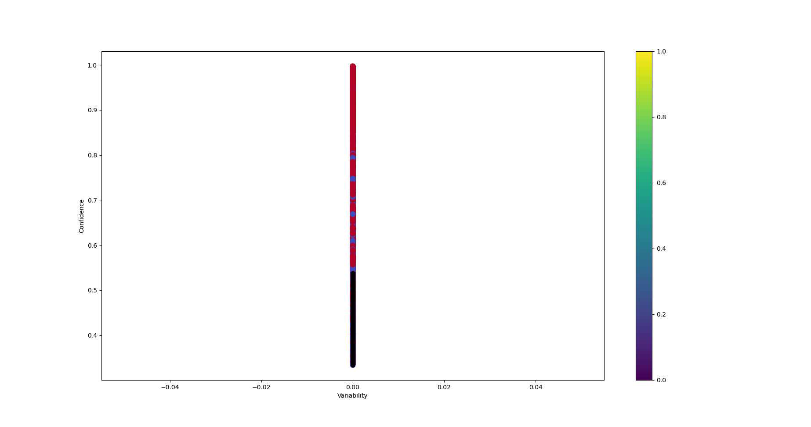
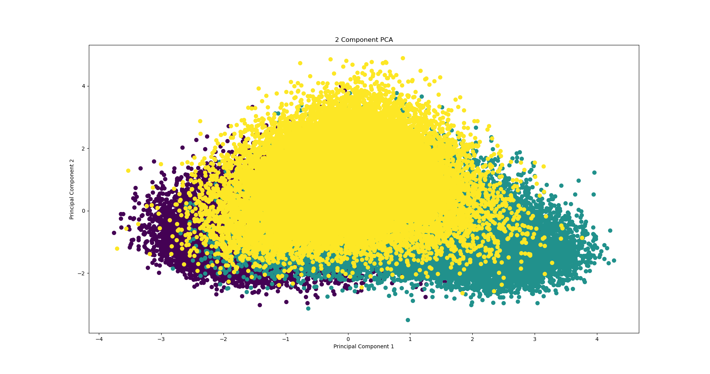
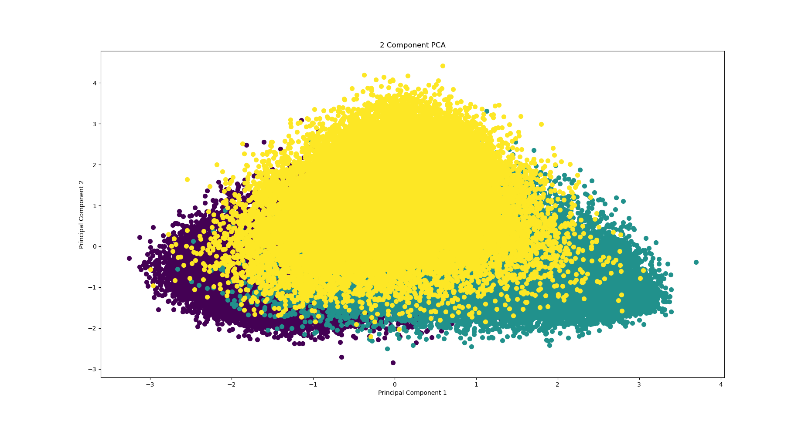
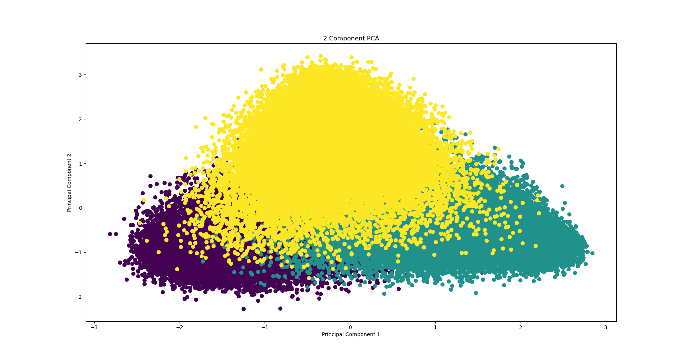
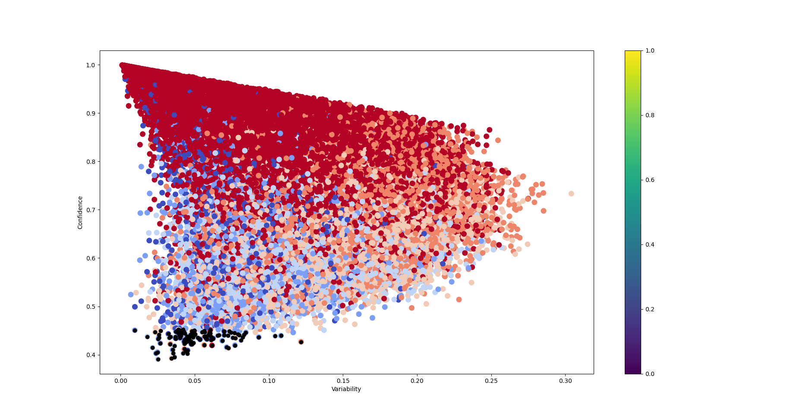
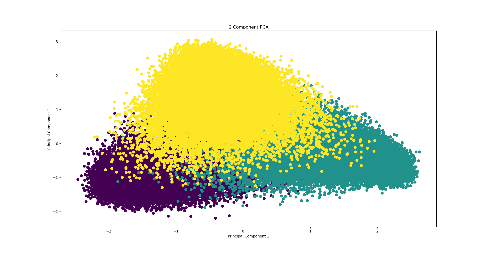
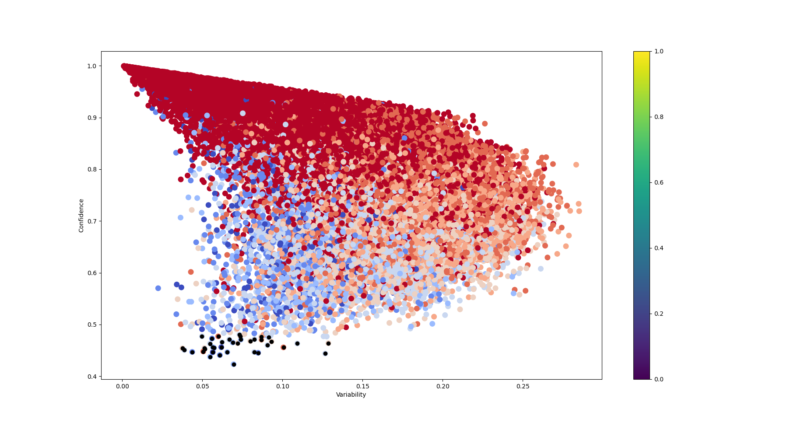

# RO_MNLI Area Under the Margin, Dataset Cartography and Confident Learning
## Model Training Overview

Using Dataset Cartography for training dataset, I had ploted the mean and variance of the true probability for the first 7 epochs of training.

Using Confident Learning I had calculated each class threshold and based on those thresholds calculated the percentage of mislabeled data for each class after the first 7 epochs.

Using Area Under the Margin I had sorted the dataset and selected the minimum percentage calculated above for each class as mislabeled.

By aggregating the percentages across classes, I determined the overall percentage of mislabeled data for every epoch and visualized it using Dataset Cartography.

The model appears to start overfitting after the first two epochs.

## Training Configuration

- **Model Architecture:** [BERT]
- **Dataset:** [RO_MNLI]

## Training and Validation Plot

## Epoch-wise Breakdown

### Epoch 1

**Epoch 1 Dataset_Cartography**

**Confident Learning Matrix**

|             | Neutral     | Entailment  | Contradiction |
|-------------|-------------|-------------|--------------|
| **Neutral**     | 0.25689212  | 0.026292    | 0.02707207   |
| **Entailment**  | 0.03859587  | 0.27687262  | 0.01459091   |
| **Contradiction** | 0.05201667  | 0.021452    | 0.28621576   |

**Statistics:**
- Total percentage mislabeled data (using Dataset Cartography): 18%  [data](./data/epoch1/cartography_mislabeled.txt)
- Percentage mislabeled entailment data (using AUM): 5%  [data](./data/epoch1/mislabeled_entailment.txt)
- Percentage mislabeled neutral data (using AUM): 7%  [data](./data/epoch1/mislabeled_neutral.txt)
- Percentage mislabeled contradiction data (using AUM): 6%  [data](./data/epoch1/mislabeled_contradiction.txt)

**Epoch 1 PCA Logits**

### Epoch 2

**Epoch 2 Dataset_Cartography**

**Confident Learning Matrix**

|               | Neutral    | Entailment  | Contradiction |
|---------------|------------|-------------|---------------|
| Neutral       | 0.29106397 | 0.0126567   | 0.00920122    |
| Entailment    | 0.01219463 | 0.31724124  | 0.00229026    |
| Contradiction | 0.02000964 | 0.00594664  | 0.32939569    |

**Statistics:**
- Total percentage mislabeled data (using Dataset Cartography): 6%  [data](./data/epoch2/cartography_mislabeled.txt)
- Percentage mislabeled entailment data (using AUM): 2%  [data](./data/epoch2/mislabeled_entailment.txt)
- Percentage mislabeled neutral data (using AUM): 2%  [data](./data/epoch2/mislabeled_neutral.txt)
- Percentage mislabeled contradiction data (using AUM): 2%  [data](./data/epoch2/mislabeled_contradiction.txt)

**Epoch 2 PCA Logits**

### Epoch 3

**Epoch 3 Dataset_Cartography**

**Confident Learning Matrix**

|               | Neutral     | Entailment  | Contradiction |
|---------------|-------------|-------------|---------------|
| Neutral       | 0.3043935   | 0.00542097  | 0.00271048    |
| Entailment    | 0.00285756  | 0.33196058  | 0.0005463     |
| Contradiction | 0.00544198  | 0.00178598  | 0.34488265    |

**Statistics:**
- Total percentage mislabeled data (using Dataset Cartography): 1.8%  [data](./data/epoch3/cartography_mislabeled.txt)
- Percentage mislabeled entailment data (using AUM): 0.8%  [data](./data/epoch3/mislabeled_entailment.txt)
- Percentage mislabeled neutral data (using AUM): 0.3%  [data](./data/epoch3/mislabeled_neutral.txt)
- Percentage mislabeled contradiction data (using AUM): 0.7%  [data](./data/epoch3/mislabeled_contradiction.txt)

**Epoch 3 PCA Logits**

### Epoch 4

**Epoch 4 Dataset_Cartography**

**Confident Learning Matrix**

|               | Neutral           | Entailment        | Contradiction     |
|---------------|-------------------|-------------------|-------------------|
| Neutral       | 3.08610146e-01    | 2.15200392e-03    | 7.24436963e-04    |
| Entailment    | 4.04832421e-04    | 3.36692732e-01    | 2.13069695e-04    |
| Contradiction | 1.02273454e-03    | 4.04832421e-04    | 3.49775211e-01    |

**Statistics:**
- Total percentage mislabeled data (using Dataset Cartography): 0.36%  [data](./data/epoch4/cartography_mislabeled.txt)
- Percentage mislabeled entailment data (using AUM): 0.3%  [data](./data/epoch4/mislabeled_entailment.txt)
- Percentage mislabeled neutral data (using AUM): 0.06%  [data](./data/epoch4/mislabeled_neutral.txt)
- Percentage mislabeled contradiction data (using AUM): 0.1%  [data](./data/epoch4/mislabeled_contradiction.txt)

**Epoch 4 PCA Logits**

### Epoch 5

**Epoch 5 Dataset_Cartography**

**Confident Learning Matrix**

|                 | Neutral           | Entailment        | Contradiction     |
|-----------------|-------------------|-------------------|-------------------|
| Neutral         | 3.09694947e-01    | 5.13412912e-04    | 2.78098661e-04    |
| Entailment      | 8.55688187e-05    | 3.37932657e-01    | 4.27844094e-05    |
| Contradiction   | 1.71137637e-04    | 1.28353228e-04    | 3.51153040e-01    |

**Statistics:**
- Total percentage mislabeled data (using Dataset Cartography): 0.13%  [data](./data/epoch5/cartography_mislabeled.txt)
- Percentage mislabeled entailment data (using AUM): 0.01%  [data](./data/epoch5/mislabeled_entailment.txt)
- Percentage mislabeled neutral data (using AUM): 0.02%  [data](./data/epoch5/mislabeled_neutral.txt)
- Percentage mislabeled contradiction data (using AUM): 0.1%  [data](./data/epoch5/mislabeled_contradiction.txt)

**Epoch 5 PCA Logits**

### Epoch 6

**Epoch 6 Dataset_Cartography**

**Confident Learning Matrix**

|               | Neutral           | Entailment        | Contradiction     |
|---------------|-------------------|-------------------|-------------------|
| Neutral       | 3.10238513e-01    | 3.42568407e-04    | 6.42315762e-05    |
| Entailment    | 6.42315762e-05    | 3.37708217e-01    | 2.14105254e-05    |
| Contradiction | 3.21157881e-04    | 6.42315762e-05    | 3.51175438e-01    |

**Statistics:**
- Total percentage mislabeled data (using Dataset Cartography): 0.08%  [data](./data/epoch6/cartography_mislabeled.txt)
- Percentage mislabeled entailment data (using AUM): 0.01%  [data](./data/epoch6/mislabeled_entailment.txt)
- Percentage mislabeled neutral data (using AUM): 0.02%  [data](./data/epoch6/mislabeled_neutral.txt)
- Percentage mislabeled contradiction data (using AUM): 0.1%  [data](./data/epoch6/mislabeled_contradiction.txt)

**Epoch 6 PCA Logits**

### Epoch 7

**Epoch 7 Dataset_Cartography**

**Confident Learning Matrix**

|                | Neutral           | Entailment        | Contradiction     |
|----------------|-------------------|-------------------|-------------------|
| Q matrix       | 3.10294590e-01    | 1.71397965e-04    | 0.00000000e+00    |
| Entailment     | 1.07123728e-04    | 3.38039636e-01    | 0.00000000e+00    |
| Contradiction  | 8.56989823e-05    | 4.28494912e-05    | 3.51258704e-01    |

**Statistics:**
- Total percentage mislabeled data (using Dataset Cartography): 0.06%  [data](./data/epoch7/cartography_mislabeled.txt)
- Percentage mislabeled entailment data (using AUM): 0.01%  [data](./data/epoch7/mislabeled_entailment.txt)
- Percentage mislabeled neutral data (using AUM): 0.01%  [data](./data/epoch7/mislabeled_neutral.txt)
- Percentage mislabeled contradiction data (using AUM): 0.04%  [data](./data/epoch7/mislabeled_contradiction.txt)

**Epoch 7 PCA Logits**

## Conclusion

Need to compare the misabeled data after each epoch because overfitting on data reduces the percentage of mislabeled dataset points.

---
